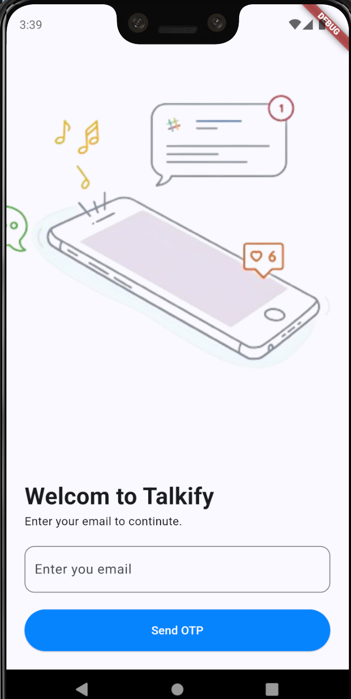
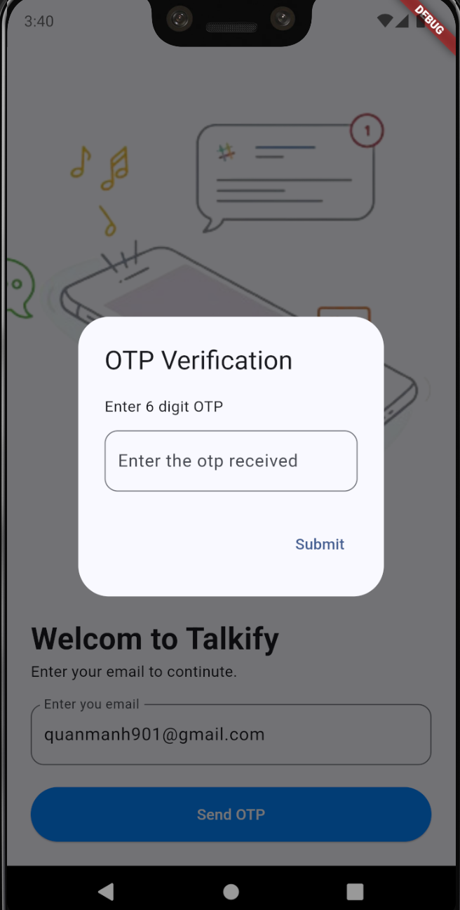
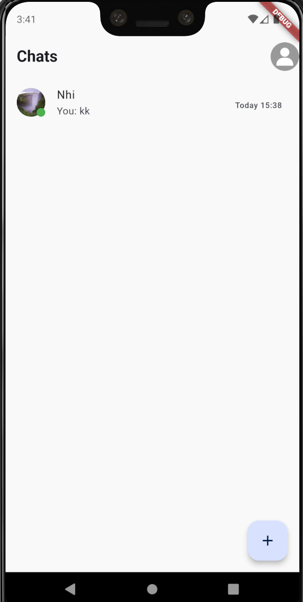
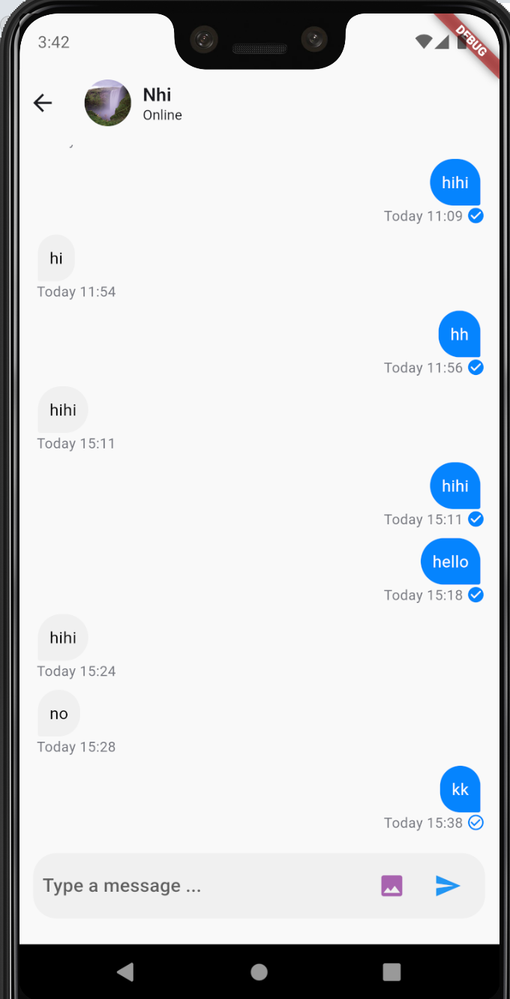
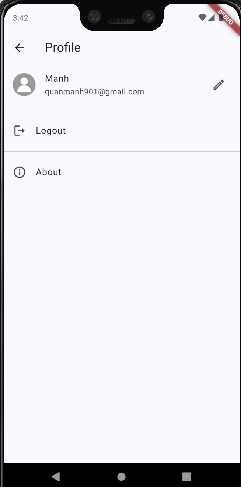
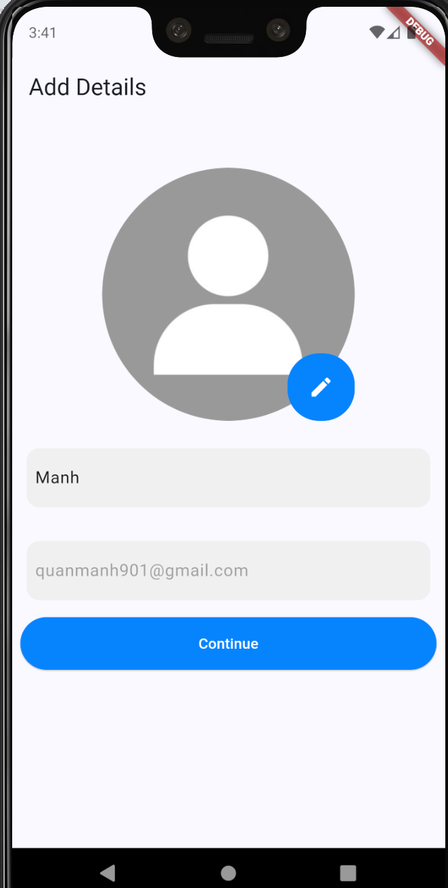
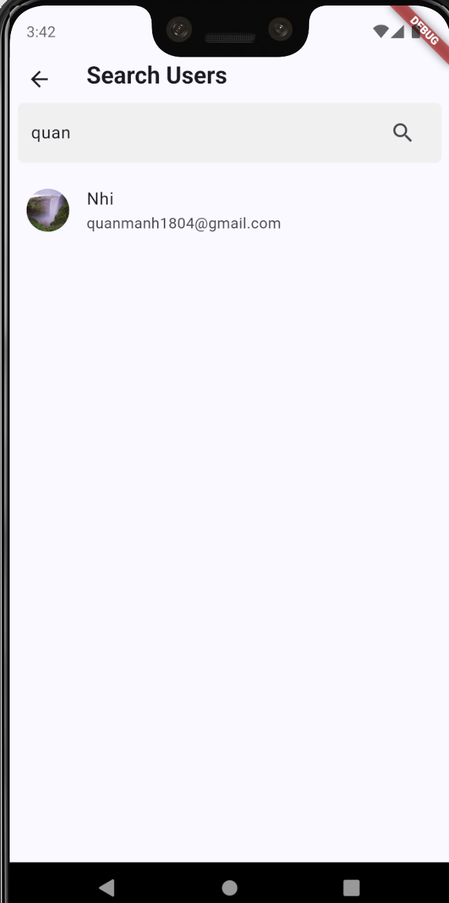

# APP TALKIFY
TalkifyApp is a cross-platform chat application that allows users to send messages, share images, and videos in real-time. The app features a user-friendly interface, high security, and supports various functions such as group chats, file sharing, and push notifications. With TalkifyApp, staying connected and communicating is convenient and fast, making it suitable for both personal and professional use


## Authors
- [Quan Văn Mạnh](https://github.com/Manh-IT-K2)

## Project Description:
TalkifyApp offers essential features such as email login with OTP verification, user search, real-time messaging, and profile customization.
## Tech Stack Used:
```bash
    * Dart
    * Firebase
    * AppWrite
```
## Main features of the application:
```bash
1. Login:
    - Enter your email.
    - Enter the otp sent to your email.
2. Search User:
    - Enter the email of the user you want to find.
3. Chat:
    - Enter the content you want to send.
    - Select the image you want to send.
4. Edit Profile:
    - Enter the name you want to change.
    - Select the photo you want to use as an avatar.
```

## Dependencies used in the project
```bash
   ## Appwrite
      - appwrite: ^12.0.1
   ## Country code picker
      - country_code_picker: ^3.0.0
   ## File picker
      - file_picker: ^7.0.2
   ## Firebase core
      - firebase_core: ^2.24.2
   ## Firebase messaging
      - firebase_messaging: ^14.7.10
   ## Notification
      - flutter_local_notifications: ^17.1.2
   ## Provider
      - provider: ^6.1.2
   ## Sharedpreferences
      - shared_preferences: ^2.2.2
   ## Network image
      - cached_network_image: ^3.3.1
   ## Http
      - http: ^1.1.0
```
## Project Demo

   Youtobe: https://youtu.be/ZYVD3bDzIbo

   
## Application interface:

| Login | Otp | Home | Chat |
|:-----:|:---:|:----:|:----:|
|  |  |  |  |

| Profile | EditProfile | Search | 
|:-------:|:-----------:|:------:|
|  |  |  |

### Make sure to star the repository if you find it helpful!
<a href="https://github.com/Manh-IT-K2/TalkifyApp/stargazers"></a>

